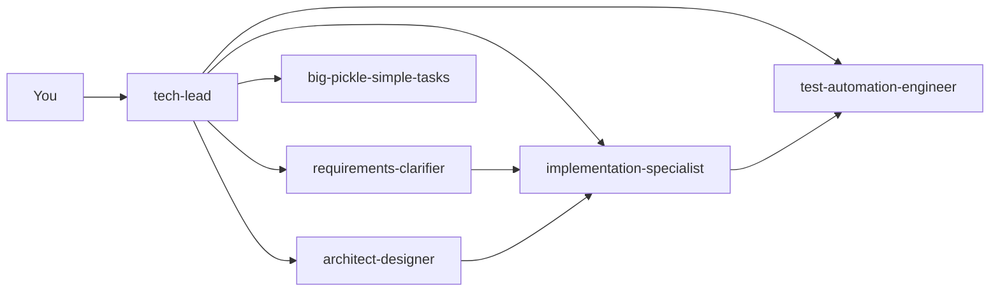

<p align="center">
  
</p>

<h1 align="center">opencode-for-starters</h1>

<p align="center">
  <b>Drop it into any project and get a full AI development pipeline with specialized agents that work together.</b>
</p>

<p align="center">
  <a href="https://github.com/ayushks1ngh/opencode-for-starters/stargazers">
    
  </a>
  <a href="https://github.com/ayushks1ngh/opencode-for-starters/blob/main/LICENSE">
    
  </a>
  <a href="https://opencode.ai">
    
  </a>
</p>

---

## Features

- **6 specialized agents** that auto-chain: clarify requirements → design architecture → implement → test
- **Orchestrator agent** (`tech-lead`) delegates work to the right specialist based on task complexity
- **AGENTS.md rules** loaded every session — the pipeline runs automatically
- **`/build`** command — auto-detects project type and runs the right build tool
- **`/scan`** command — runs vulnerability audits (npm audit, cargo audit, pip audit, etc.)
- **`ship it`** skill — commit, push, PR, and auto-review in one phrase
- **Zero deps** — clone and go

## How It Works



The `AGENTS.md` file is loaded as instructions in every session. When you type a request:

1. **Vague or complex** → `@tech-lead` breaks it down and chains specialists
2. **Clear bug fix** → `@implementation-specialist` handles it directly
3. **Architecture question** → `@architect-designer` produces design docs
4. **Unsure where to start** → `@big-pickle-simple-tasks` decomposes into steps

| Agent | Mode | Role |
|---|---|---|
| `tech-lead` | primary | Orchestrator — routes work to specialists |
| `requirements-clarifier` | subagent | Vague ideas → structured specs with AC |
| `architect-designer` | subagent | Design docs, ADRs, diagrams — zero code |
| `implementation-specialist` | subagent | Writes code, strict no-architectural-drift |
| `test-automation-engineer` | subagent | Writes & runs tests, reports coverage |
| `big-pickle-simple-tasks` | primary | Big work → small actionable steps |

## Quick Start

```bash
cd your-project
git clone https://github.com/ayushks1ngh/opencode-for-starters.git .opencode
opencode .
```

Or install globally:

```bash
git clone https://github.com/ayushks1ngh/opencode-for-starters.git ~/.config/opencode
```

Then just start typing. The pipeline picks up automatically.

## What's Inside

```
AGENTS.md                  # pipeline rules (loaded every session)
.opencode/
├── opencode.json          # model config + instructions
├── agent/                 # 7 custom agents
│   ├── tech-lead.md
│   ├── requirements-clarifier.md
│   ├── architect-designer.md
│   ├── implementation-specialist.md
│   ├── test-automation-engineer.md
│   ├── big-pickle-simple-tasks.md
│   └── scan.md
├── command/
│   ├── build.md
│   └── scan.md
└── skills/ship/SKILL.md   # one-command PR pipeline
```

## Commands

| Command | What it does |
|---|---|
| `/build` | Auto-detects project type, runs build |
| `/scan` | Runs security audit (npm/cargo/pip) |
| `ship it` | Stages, commits, pushes, opens PR, triggers review |

## License

MIT
