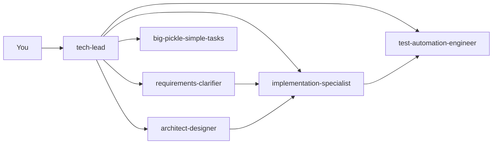

<p align="center">
  
</p>

<h1 align="center">opencode-for-all</h1>

<p align="center">
  <b>Batteries-included opencode config — drop it into any project and get a full AI development pipeline.</b>
</p>

<p align="center">
  <a href="https://github.com/ayushks1ngh/opencode-for-all/stargazers">
    
  </a>
  <a href="https://github.com/ayushks1ngh/opencode-for-all/blob/main/LICENSE">
    
  </a>
  <a href="https://opencode.ai">
    
  </a>
</p>

---

## Features

- **6 specialized agents** — architect, implementer, tester, PM, orchestrator, task-breakdown
- **One-command ship** — commit, push, PR, and auto-review with a single phrase
- **Full keybinding overhaul** — Vim-inspired, leader key `Ctrl+O`
- **Zero setup** — clone and go, no dependencies to install
- **Works everywhere** — per-project or global install

## Agent Pipeline



| Agent | Mode | Role |
|---|---|---|
| `tech-lead` | `primary` | Orchestrator — routes work to specialists |
| `requirements-clarifier` | `subagent` | Turns vague ideas into actionable specs |
| `architect-designer` | `subagent` | Design docs, ADRs, diagrams — zero code |
| `implementation-specialist` | `subagent` | Writes code, strict no-architectural-drift |
| `test-automation-engineer` | `subagent` | Writes & runs tests, reports coverage |
| `big-pickle-simple-tasks` | `primary` | Breaks big work into small steps |

## Quick Start

### Per-project (recommended)

```bash
cd your-project
git clone https://github.com/ayushks1ngh/opencode-for-all.git .opencode
opencode .
```

### Global install

```bash
git clone https://github.com/ayushks1ngh/opencode-for-all.git ~/.config/opencode
# or:
bash setup.sh --global
```

### Ship it

Make some changes, stage them, then:

```
ship it
```

This will commit, push, open a PR, and auto-post an `/oc review` comment.

## What's Inside

```
.opencode/
├── opencode.json          # default model + autoupdate
├── tui.json               # ctrl+o leader, Vim keybinds
├── agent/                 # 6 custom agents
│   ├── tech-lead.md
│   ├── requirements-clarifier.md
│   ├── architect-designer.md
│   ├── implementation-specialist.md
│   ├── test-automation-engineer.md
│   └── big-pickle-simple-tasks.md
├── command/               # custom /build and /scan
│   ├── build.md
│   └── scan.md
└── skills/ship/SKILL.md   # one-command PR pipeline
```

## Keybindings

Leader key is `Ctrl+O`. Some highlights:

| Binding | Action |
|---|---|
| `Ctrl+O e` | Open editor |
| `Ctrl+O a` | List agents |
| `Ctrl+O m` | Switch model |
| `Ctrl+O n/p` | Next/previous message |
| `Ctrl+O y` | Copy message |
| `Ctrl+O s` | Status view |
| `Tab` / `Shift+Tab` | Cycle agents |
| `Ctrl+P` | Command palette |
| `F2` | Cycle recent models |

See `.opencode/tui.json` for the full list.

## License

MIT

## Credits

Inspired by [omerxx/dotfiles](https://github.com/omerxx/dotfiles).
